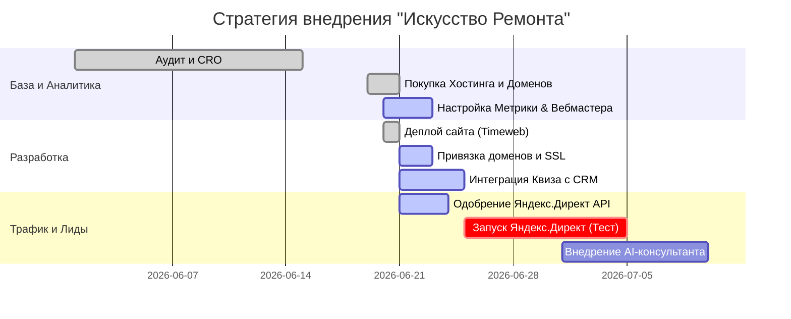
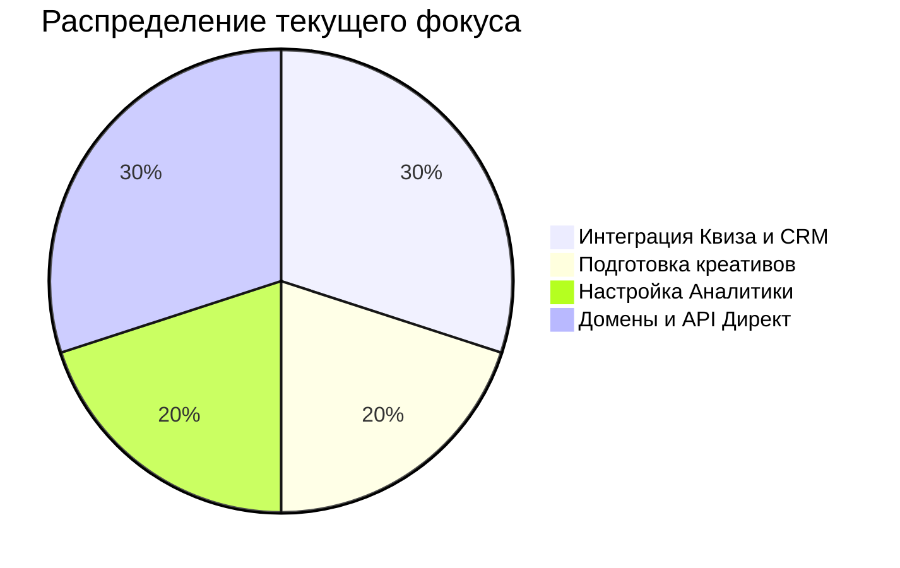

# 🏗 Искусство Ремонта (г. Сочи) — Статус Проекта

> **Актуальная сводка для заказчика (Иванец Стас)**
> *Документ отражает текущий прогресс, выполненные этапы и дальнейший вектор развития маркетинговой и технической инфраструктуры.*

---

## 📊 Дорожная карта и Стратегия (Roadmap)

---

## ✅ Что уже сделано (Фундамент готов)

Мы завершили огромный пласт технической и стратегической работы:

### ⚙️ Техническая часть
- **Сайт задеплоен:** Проект успешно размещен на новом скоростном хостинге Timeweb (пока доступен по техническому адресу `ce847095.tw1.ru`).
- **SEO-Оптимизация:** Настроены динамические SEO-теги, сгенерированы `sitemap.xml` и `robots.txt`, добавлена микроразметка Schema.org для нейросетей и ИИ-поисковиков.
- **Домены выкуплены:** Оплачены целевые домены `art-remont-sochi.ru` и `искусство-ремонта23.рф`.
- **Воронка конверсии (CRO):** Внедрена AJAX-отправка форм без потери лидов (настроена логика кнопок мессенджеров на финальном шаге квиза-калькулятора).

### 📈 Маркетинг и Аналитика
- **Сквозная аналитика:** В процессе базовое подключение *Яндекс.Метрики* и *Google Analytics 4*, ожидаем привязки доменов для подтверждения прав в *Яндекс.Вебмастере*.
- **Упаковка продукта:** Разработаны 3 тарифа (Comfort, Business, Premium) с фиксированной ценой, отстроено позиционирование под премиум-сегмент Сочи.
- **Конкурентная разведка:** Сформированы профили конкурентов и созданы посадочные страницы сравнения (например, *vs Форс Монтаж*).
- **Скрипты и Продажи:** Готовы скрипты квалификации, отработки возражений и коммерческие предложения (Leave-Behind) для менеджеров.

---

## ⏳ Что происходит прямо сейчас (В работе)

1. **Активация доменов:** Паспортные данные (Иванец Стас) успешно получены и переданы регистратору. Ожидаем обновления DNS-записей (обычно 2-24 часа), после чего сайт будет доступен по основному адресу.
2. **Интеграция с CRM:** Связываем онлайн-калькулятор с вашей CRM-системой (Bitrix24/amoCRM) для автоматического падения лидов.
3. **Дизайн:** Отрисовываем графические креативы и баннеры для рекламных сетей Яндекса.
4. **Яндекс.Директ:** Ожидаем одобрения заявки на использование API (1-3 дня) для автоматизации управления рекламой.
5. **Аналитика:** Настраиваем цели в Метрике и Google Analytics, ожидаем возможности подтвердить права в Вебмастере после настройки домена.

---

## 🚀 Следующие шаги (Ближайшие планы)

Как только мы получим данные и подтверждения от сервисов, мы перейдем к:

- [ ] **Запуску трафика:** Утверждение тестового бюджета (1000 руб. в неделю) и старт кампаний в Яндекс.Директ (Поиск + РСЯ).
- [ ] **SSL и Безопасность:** Выпуск SSL-сертификатов (HTTPS) для обоих доменов после их привязки.
- [ ] **Масштабированию (SMM):** Подготовка к съемкам Reels/Shorts на строящихся объектах.
- [ ] **Партнерской сети:** Внедрение реферальной программы ("Приведи клиента") для сочинских дизайнеров интерьера и запуск локальной рекламы в Telegram.

> **💡 Главная мысль:** Мы построили технологически мощный фундамент. Сайт работает быстро и готов к приему трафика. Сейчас мы занимаемся тонкой настройкой аналитики (Метрика, Вебмастер), чтобы не потерять ни одного лида и собрать максимум данных. Как только аналитика будет готова, а домен привязан — "поворачиваем ключ" и начинаем тесты!
